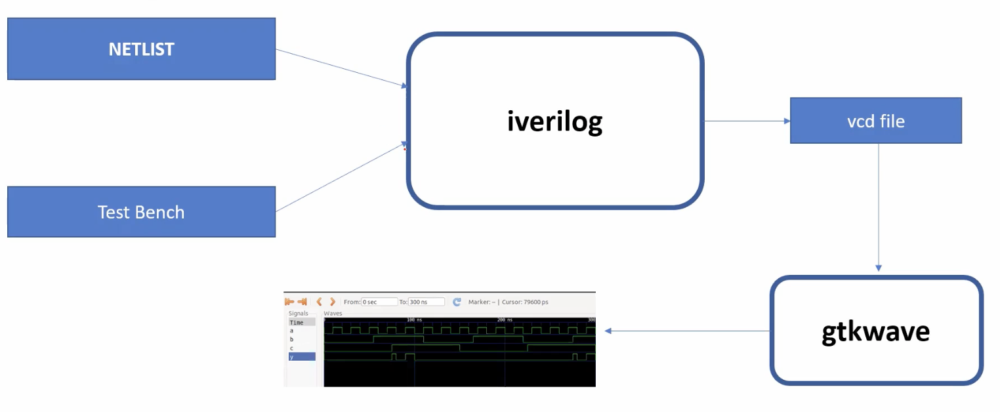
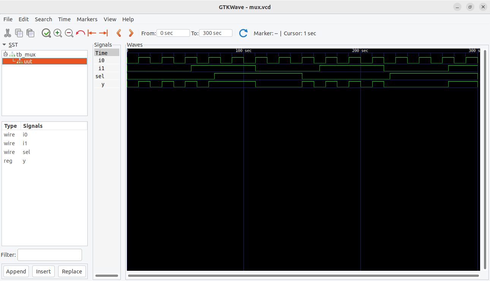
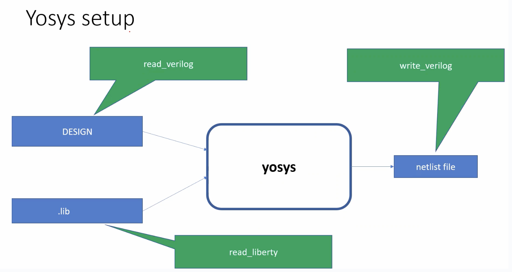
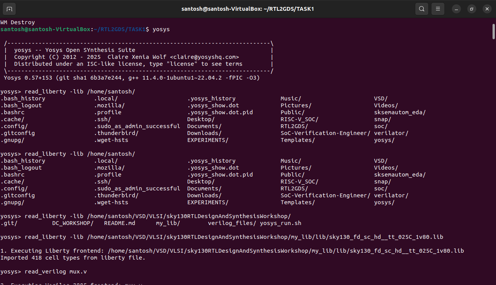
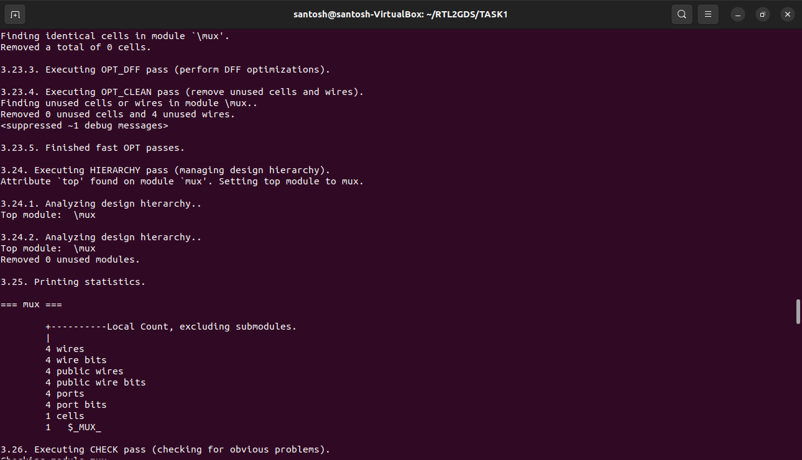
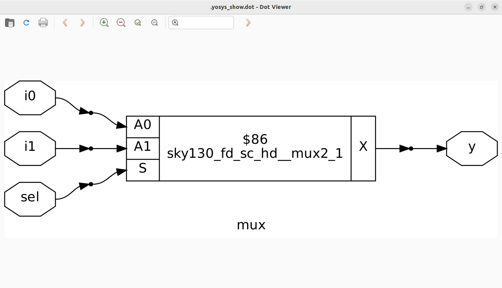

# Day 1 - Introduction to Verilog RTL Design and Synthesis
## Introduction to open-source simulator Iverilog

Folder structure of the git clone:
- `lib` - will contain sky130 standard cell library
- `my_lib/verilog_models` - will contain standard cell verilog model
- `verilog_files` -contains the lab experiments source files




Example of a design mux.v 

```
module mux (input i0 , input i1 , input sel , output reg y);
    always @ (*)begin
	if(sel)
		y <= i1;
	else 
		y <= i0;
    end
endmodule
```
Example of a testbench tb_mux.v 

```
`timescale 1ns / 1ps
module tb_mux;
	// Inputs
	reg i0,i1,sel;
	// Outputs
	wire y;

        // Instantiate the Unit Under Test (UUT)
	mux uut (
		.sel(sel),
		.i0(i0),
		.i1(i1),
		.y(y)
	);

	initial begin
	$dumpfile("mux.vcd");
	$dumpvars(0,tb_mux);
	// Initialize Inputs
	sel = 0;
	i0 = 0;
	i1 = 0;
	#300 $finish;
	end

always #75 sel = ~sel;
always #10 i0 = ~i0;
always #55 i1 = ~i1;
endmodule
```
Command to run the design and testbench
```
iverilog mux.v tb_mux.v
```
The output of the iverilog is a .vcd file and a.out file is created. By executing a.out iverilog dump the vcd file.

## Introduction to GTKWave
gtkwave will be used to generate the waveforms and display in visual format.

Command to view the vcd file in gtkwave 
```
gtkwave mux.vcd
```
The waveform in gtwave is shown below


## Introduction to Yosys
It is the synthesizer used to convert RTL to netlist.
Netlist should be the same as the Design but represented in the form of standard cells.
The same testbench can be used to verify RTL and Synthesized Netlist.




## Lab using Yosys and Sky130 PDKs





</details>

<details>
